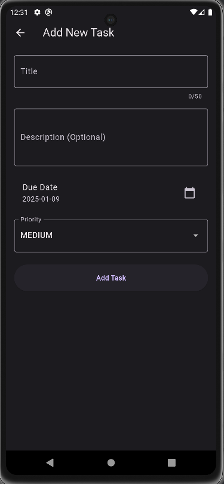
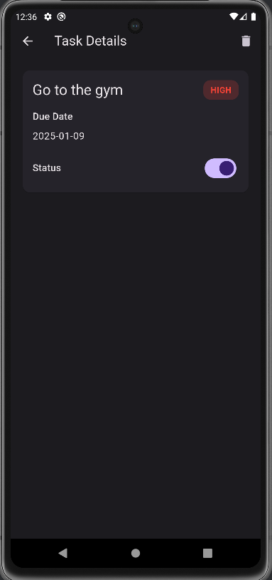

# Task Management App

A simple and elegant mobile application built with Flutter for managing tasks. This app allows users to create, view, and manage their tasks with features such as marking tasks as completed, deleting tasks, and prioritizing them. The app is designed with a clean and responsive UI using Material Design principles.

---

## Key Features

- **Task List**
    - Displays all tasks in a list view.
    - Each task shows the task name, due date (if set), and priority (High, Medium, Low).

- **Add Task**
    - Users can add new tasks through a simple form.
    - Includes the following fields:
        - **Task Name**.
        - **Due Date**.
        - **Priority**(High, Medium, Low).
    - Task data is stored locally using Hive for persistent storage.

- **Manage Tasks**
    - **Mark as Completed**:
        - Toggle task completion status using a button/checkbox.
        - Completed tasks are visually differentiated (e.g., strike-through text).
    - **Delete Task**:
        - Users can delete tasks from the list.

- **Responsive UI**
    - Designed with Flutter's Material Design widgets.
    - Ensures usability across different Android device sizes.

---

## Bonus Features (Optional)
- **Edit Task**: Edit task details directly from the task list.
- **Dark Mode**: Toggle between light and dark themes.

---

## Screenshots








---

## Installation

To run this app on your local machine, follow these steps:

1. **Clone the Repository**:
   ```bash
   git clone https://github.com/your-username/task-management-app.git
   cd task-management-app

2. **Install Dependencies**:
   Ensure you have Flutter installed. Run the following command:

   ```bash
   flutter pub get

3. **Run the App**:
   Connect an Android device or emulator and run:

   ```bash
    flutter run


## Download APK

You can download the APK file to test the app directly on your Android device.

- **APK File**:  
  [Download the Task Management App APK](https://github.com/your-username/your-repository-name/raw/main/apk/app-release.apk)  
  
